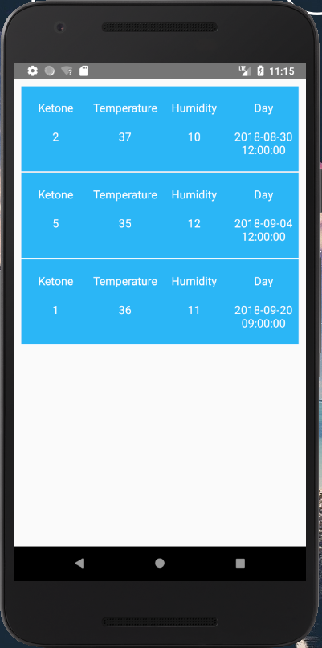

# DiabeteCheck

An android app, dedicated for children who suffer from diabete.
The app will help following the child's condition using both hardware and software solutions, the user must be an adult responsable for the child with collaboration with a certified doctor, once these conditions met, our admins will provide you an account so you can use the app.

## Getting Started

In order to start you need to register with us so we can give you t, so for that contact me on : Diabete_Check@gmail.com, so we can study your case.
and provide you with the device and the account.
Once the account provided just LOGIN.

## How to use

### Ketone,Temperature,Humidity Tests (Hardware)

use the device we gave you with subscription, the sensor of the device must retain in the child's mouth for at least 10 seconds so that the results will be precise, once u hear the bip it means that the data have been gathered you can remove the sensor.

### Checking the results (Software)
use the account we gave you with subscripton then :

### #1- Getting the results:
Goto->Dashboard->Analyse:

### #2- Contacting your doctor:
Goto->Dashboard->Call/Message:

### #3- Getting notifications:
Goto-> Notification:

### #4- Visualising your statistics:
Goto-> Statistics:

### #5- Results History:
Goto-> History

## Built With

* [Andoid](https://developer.android.com/studio/) - Using Android studio
* [Gradle](https://gradle.org/) - Dependency Management

## Authors

* **Boukhoulda Salaheddine** - *Initial work* - [SalaheddineDz](https://github.com/SalaheddineDz)

## License

No license included
